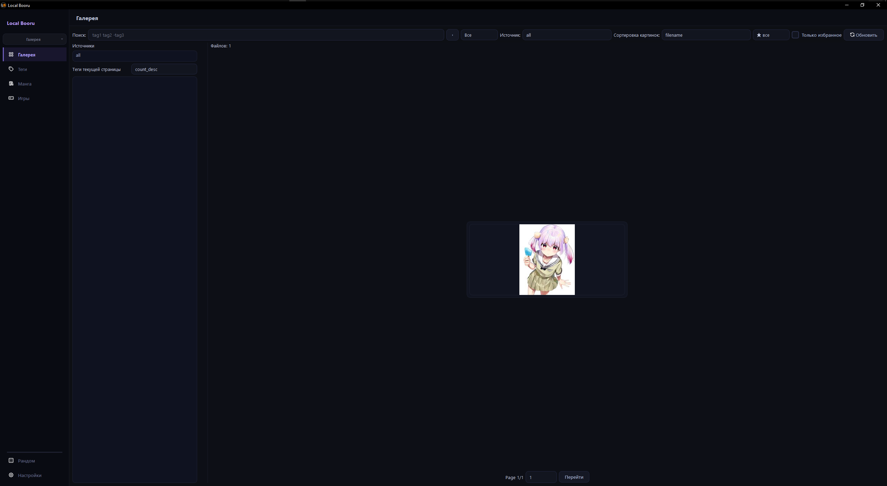
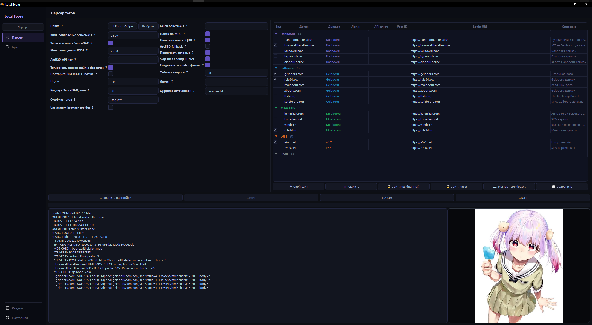
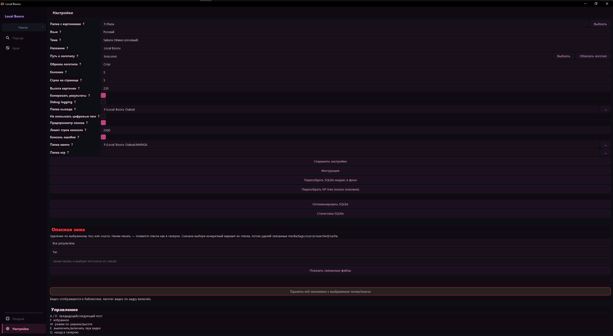
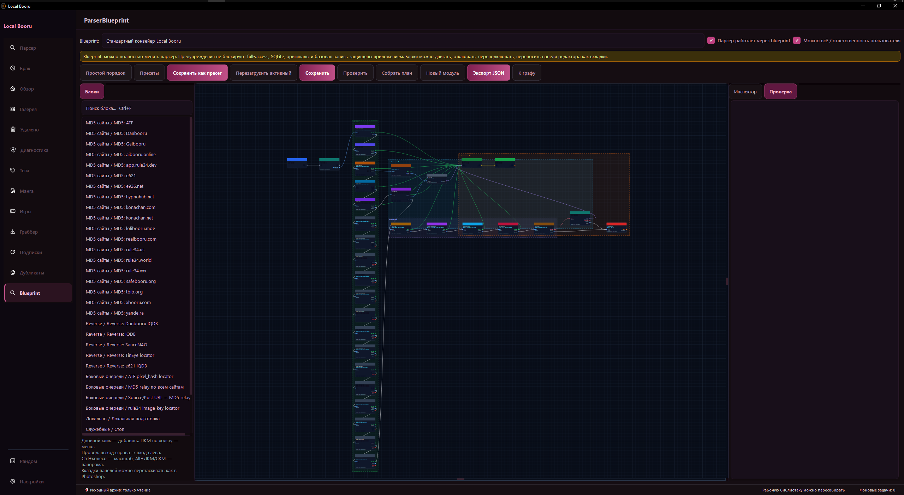

# Local Booru

Local Booru is a local Windows application for managing a large image and video archive in a booru-style workflow.

It started as a simple parser: add a folder, find sources, fetch tags, and save everything into a database. Over time it grew into a gallery, downloader, duplicate cleaner, subscriptions system, built-in browser, grabber, SQLite backend, Blueprint parser, and a set of safeguards to keep a large archive from accidentally turning into a mess.

The goal is simple: less manual routine. If a file can be found by MD5, by source, by visual similarity, or through a booru API, the program should try to do it automatically.

---

## Download

[Download Local Booru v1.5](https://github.com/Ucellar/Local_Booru/releases/tag/v1.5)

# Gallery



*This is a test screen. With a real archive it looks noticeably better, but I cannot include my own archive here for obvious reasons.*

---

# Auto Tagger



---

# Settings



---

# Blueprint



---

## What it is for

If your archive looks something like this:

```text
New folder
New folder (2)
Sort later
Sort later 2
Definitely sort later
Sort someday, maybe
```

then this program is exactly about that.

Local Booru is not made for twenty pictures. It is made for cases where you already have thousands or tens of thousands of files, and manually searching for sources, copying tags, cleaning duplicates, and sorting everything into folders stops making sense.

---

## Features

- local image and video gallery;
- separate manga gallery;
- search by tags, sources, and text fields;
- automatic source and tag lookup;
- exact MD5 search;
- similar-file search using pHash;
- reverse search through IQDB, Danbooru IQDB, e621 IQDB, SauceNAO, and TinEye;
- downloading found posts;
- subscriptions to tags and artists;
- duplicate search and cleanup;
- thumbnail cache;
- SQLite database for tags, sources, site statuses, and queues;
- support for multiple booru sources;
- custom site support;
- built-in browser and browser companion for difficult sites;
- visual Blueprint parser for pipeline configuration;
- multiple UI themes.

---

## What is new in v1.5

v1.5 focuses on first-run usability and safer database rebuilds.

Added:

- **First-run language picker** — on a fresh workspace/profile the app asks the user to choose **English** or **Russian** before opening the main window.
- The language choice is saved in settings as `language` and `language_selected_once`, so the dialog appears only once.
- The interface language can still be changed later from the Settings page.
- Added English public README text for GitHub publication.

Fixed and improved:

- Fixed the `m024_reverse_branch_status` migration crash that could happen after deleting and rebuilding the SQLite database.
- Migration journaling now has a safe fallback name if a future migration file misses its `NAME` field.
- Legacy NO_MATCH and deleted-file registry imports now commit in batches, reducing long SQLite writer locks during clean database rebuilds.
- Parser startup no longer treats a locked SQLite database as an empty database.
- Added safer SQLite startup readiness checks and a low-memory parser profile for large archive runs.

---

## How source lookup works

The program first tries the fast path:

```text
file → real MD5 → booru site checks → tags and source
```

If the exact MD5 is not found, the file can be sent to a slower reverse-search queue:

```text
IQDB → Danbooru IQDB → e621 IQDB → SauceNAO → TinEye
```

If reverse search finds a post URL or file URL, the program tries to extract an MD5 from it and run that MD5 through the regular booru APIs again.

This is important: TinEye and SauceNAO are not primary tag sources by themselves. They help find a link or MD5, and tags are then fetched from booru sites whenever possible.

---

## Supported sources

Best tested:

- Danbooru;
- Gelbooru;
- rule34.xxx;
- rule34.us;
- e621;
- booru.allthefallen.moe;
- SauceNAO;
- TinEye as a fallback locator.

You can also add custom sites through the settings. Sites with Danbooru/Gelbooru/Moebooru-like APIs work best.

Different sites behave differently: some have a normal API, while others have limits, Cloudflare, captchas, or unstable responses. Because of that, adding a site does not guarantee perfect operation.

---

## Grabber and subscriptions

Subscriptions and the grabber are not just “download images by tag”.

The program tries to:

- search posts across multiple sites;
- show previews without downloading the original file;
- merge identical images from different sources;
- download the file only once;
- save tags and links from every site where the file was found;
- hide already downloaded or already processed items.

If the same image exists on multiple sites, there is no point in downloading it several times. But it is useful to collect data from all of them.

---

## Data storage

Working data is stored separately from the program code.

The usual structure is:

```text
Local_Booru_Archive/
├─ output/      # media and working library
└─ settings/    # SQLite, settings, cache, runtime, cookies, service data
```

SQLite stores:

- tags;
- sources;
- MD5 values;
- site check statuses;
- NO_MATCH/FOUND states;
- retry queues;
- parser service data.

After a bad shutdown, the app may check SQLite first and only then allow database writes. This is normal.

---

## Installing from source

### 1. Install Python

Python 3.10 or newer is required.

Check it in PowerShell:

```powershell
python --version
```

### 2. Download the project

If you downloaded a ZIP from GitHub:

1. Extract the archive.
2. Open PowerShell in the project folder.

### 3. Install dependencies

```powershell
python -m pip install --upgrade pip
python -m pip install -r requirements.txt
```

For the built-in browser and some sites, Playwright may also be required:

```powershell
python -m playwright install
```

### 4. Run the program

```powershell
python app.py
```

Or:

```text
run_from_source.bat
```

---

## Building a Windows EXE

Regular folder-based build:

```powershell
build_exe.bat
```

After the build, the program should appear roughly here:

```text
dist\Local Booru\Local Booru.exe
```

To distribute it, archive the whole folder:

```text
dist\Local Booru
```

Single-file build:

```powershell
build_exe_onefile.bat
```

For PySide6, the folder-based build is usually more stable.

---

## Important warning

The project is under active development.

Before processing a large archive, it is better to test the program on a copy of a small folder first.

This especially applies to:

- duplicate deletion;
- mass downloading;
- database rebuilding;
- subscriptions to large tags;
- work with a new site;
- manual SQLite repair.

If you click “download everything” or “delete selected”, the program will actually try to do that. Safeguards exist, but it is better not to test them on the only copy of your archive.

---

## Who this program is for

Local Booru is for people who want to keep a large local image and video archive and do not want to constantly do everything manually:

- search for sources;
- copy tags;
- clean duplicates;
- sort files;
- open dozens of sites;
- track new posts.

The ideal workflow:

```text
add a folder
press start
the program tries to sort out the archive
```

It tries. Some files have already gone through Telegram, Discord, recompression, cropping, watermarks, and reuploads, so there is no such thing as perfect magic.

---

## Development

The project is actively developed with the help of AI tools, but the goal remains practical: to build a convenient local archive manager, not a demo for the sake of a demo.

Current focus:

- stability;
- large archive support;
- fast MD5 pipeline;
- asynchronous fallback queues;
- proper gallery;
- convenient grabber;
- safe SQLite model;
- less manual routine.

---

## Important

Local Booru does not provide any content by itself.

The program works with the user’s own files and with sites that the user has added or selected for search and subscriptions.

What to store, what to search for, and what to download is decided by the user.

---

## License

MIT License
